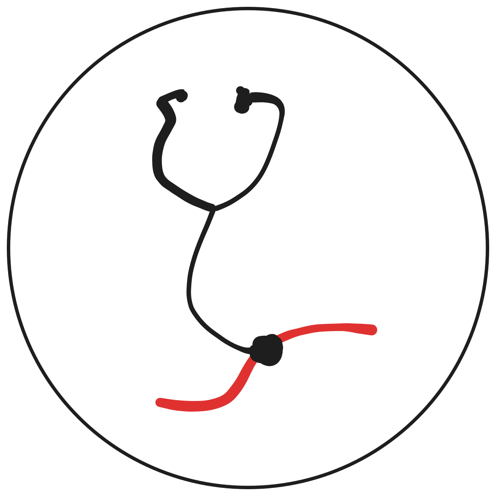

<div align="center">
  <br>

  [](https://ajsvdk.github.io/Ai-Geletterdheid-FMS/)
  [](LICENSE)
  [](https://ajsvdk.github.io/Ai-Geletterdheid-FMS/)
</div>

# AI-geletterdheid in de zorg: een praktisch overzicht

De zorgsector bevindt zich in een stroomversnelling door de opkomst van kunstmatige intelligentie (AI). Deze open source website biedt een actueel overzicht van beschikbaar AI-onderwijs voor zorgprofessionals.

🌐 **Live website**: [ajsvdk.github.io/Ai-Geletterdheid-FMS](https://ajsvdk.github.io/Ai-Geletterdheid-FMS/)

## Waarom dit platform?

Zorgprofessionals zoeken naar manieren om zich te oriënteren op het onderwijsaanbod rondom AI, toegespitst op hun specifieke praktijk. Met de komst van de Europese AI-verordening is AI-geletterdheid niet alleen waardevol, maar ook een wettelijke verplichting.

Deze site helpt je bij het vinden van:
- Cursussen en e-modules over AI in de zorg
- Praktische informatie zoals tijdsinvestering, kosten en doelgroep
- Training op verschillende niveaus: van basis tot expert
- Specifieke scholing per specialisme


## 🚨 Disclaimer en anttekening

Het doel van dit overzicht is om je inzicht te geven in het beschikbare AI-onderwijslandschap in de zorg. Het is niet bedoeld om je aan te moedigen simpelweg het nieuwste of populairste te kiezen. Begrijp waarom een bepaalde cursus beter bij jouw situatie past.

Deze site pretendeert verder geen volledig overzicht te geven van al het beschikbare onderwijs, online of offline, met betrekking tot AI voor de zorg. Ingezonden suggesties worden beoordeeld op relevantie en volledigheid, om de kwaliteit van het overzicht te waarborgen en spam te voorkomen.

## 🙌 Bijdragen

Bekijk de [bijdragepagina](https://ajsvdk.github.io/Ai-Geletterdheid-FMS/bijdragen/) voor instructies over het toevoegen van nieuwe scholingsmogelijkheden:
- Open een pull request met verbeteringen
- Bespreek ideeën in GitHub issues
- Neem contact op voor feedback
- Voeg nieuwe AI-scholingen toe via het formulier

## Open samenwerkign

Deze site is een open-source initiatief. Iedereen kan bijdragen. Denk je dat het overzicht beter kan? Open dan een pull request met updates of dien een issue in. Je kunt deze repository volgen of sterren om op de hoogte te blijven.

## Voor zorgprofessionals
- **Cursussen toevoegen** via het formulier op de website
- **Suggesties delen** voor verbetering van het overzicht

## Voor ontwikkelaars
- Draag bij aan de codebase via pull requests
- Help mee met het verbeteren van het script voor tabelgeneratie
- Automatiseer gegevensverwerking en validatie

## Lokaal draaien

```bash
# Clone de repository
git clone https://github.com/ajsvdk/Ai-Geletterdheid-FMS.git
cd Ai-Geletterdheid-FMS

# Installeer dependencies
pip install -r requirements.txt

# Start de development server
mkdocs serve
